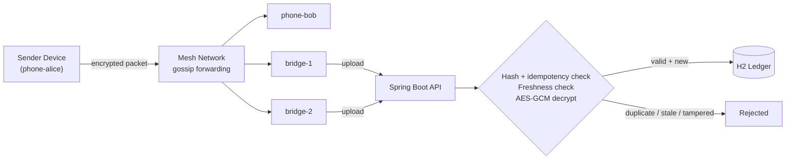
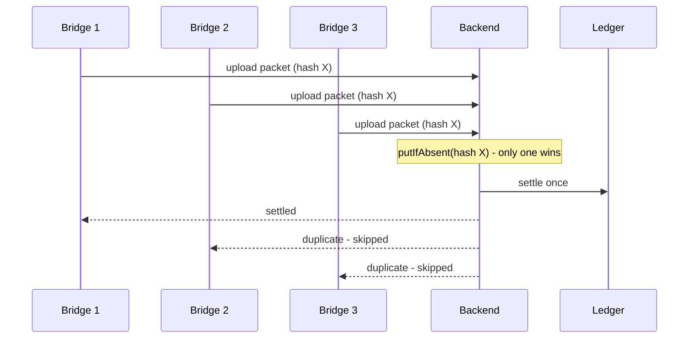

<div align="center">

# UPI Offline Mesh

**Mesh-Routed Deferred Payment Settlement**

A backend simulation of offline-first payment settlement — payments propagate through a peer-to-peer device mesh and are settled exactly once, no matter how many paths they arrive through.

[](https://upi-offline-mesh-nvgy.onrender.com)

[](https://openjdk.org/)
[](https://spring.io/projects/spring-boot)
[](https://www.docker.com/)

[](https://upi-offline-mesh-nvgy.onrender.com)

**Source:** [github.com/Ankurshrivastavaa/upi-offline-mesh](https://github.com/Ankurshrivastavaa/upi-offline-mesh) · **LinkedIn:** [Ankur Shrivastava](https://www.linkedin.com/in/ankur-shrivastava-65184724b/)

</div>

---

> **Scope note:** this is a backend engineering simulation, not a production payment product. It does not connect to real UPI, NPCI, banks, or Bluetooth/BLE hardware — the mesh is simulated in software. Everything else described below (encryption, idempotency, settlement logic) is real, working backend code.

## Overview

In areas with unreliable connectivity, a payment can't always reach a server the moment it's created. This project simulates what happens next: a payment is made offline, encrypted into a packet, and gossiped device-to-device through a mesh until a connected "bridge" device uploads it.

The interesting problem isn't the mesh — it's the backend. **The same encrypted packet can reach the server from two or three different bridges at once.** It has to be verified as untampered, checked for staleness, and settled — *exactly once* — no matter how many times or in what order copies of it show up.

## Why It's Interesting

| Challenge | Solution |
|---|---|
| Same packet delivered by multiple bridges simultaneously | SHA-256 packet hash + atomic `ConcurrentHashMap.putIfAbsent`, backed by a DB-level unique constraint |
| Payment data exposed on untrusted intermediary devices | Hybrid encryption — AES-256-GCM for the payload, RSA-OAEP to protect the AES key |
| Ciphertext modified in transit | AES-GCM's built-in authentication tag — tampering makes decryption fail outright |
| Old packets replayed later | Timestamp-based freshness window, checked before decryption |
| Two settlements racing on the same account | JPA optimistic locking (`@Version`) catches conflicting concurrent writes |
| A settlement failing partway through | `@Transactional` — debit, credit, and ledger entry commit or roll back as one unit |

## Skills This Project Demonstrates

- **Applied cryptography** — hybrid RSA-OAEP + AES-256-GCM encryption, authenticated encryption, SHA-256 hashing
- **Distributed systems thinking** — idempotent processing over unreliable, multi-path delivery
- **Concurrency control** — atomic operations, optimistic locking, race-condition-aware design
- **Data integrity** — transactional settlement with rollback guarantees
- **API design** — layered REST architecture (controller → service → model)
- **Testing discipline** — tests targeting security and concurrency edge cases, not just the happy path
- **Containerization & deployment** — Dockerized Spring Boot app, deployed to Render

## Architecture

### System Flow



### Handling Duplicate Delivery



> **Try it in the live demo:** send ₹500 from `alice@demo` to `bob@demo`, run mesh gossip, then flush multiple bridges. The dashboard shows `SETTLED ₹500 from alice@demo to bob@demo` once — every later delivery of that same packet logs `Duplicate packet detected — settlement skipped`.

## Security & Cryptography

Payment data uses **hybrid encryption**, the same general pattern behind TLS and most encrypted messaging:

1. A random AES key is generated per payment and encrypts the payload with **AES-256-GCM** — fast, and authenticated, so any tampering breaks decryption.
2. That AES key is itself encrypted with the server's public key using **RSA-OAEP**, so only the backend can recover it.
3. The resulting packet is hashed with **SHA-256** — that hash becomes the idempotency key used to catch duplicates.

This sidesteps RSA's main weakness (slow, size-limited) while keeping its benefit: no shared secret has to exist ahead of time on an untrusted device.

## Tech Stack

| Layer | Technology |
|---|---|
| Language | Java 17 |
| Framework | Spring Boot 3.3 |
| Build | Maven |
| Persistence | Spring Data JPA / Hibernate, H2 |
| Security | RSA-OAEP, AES-256-GCM, SHA-256 |
| Concurrency | `ConcurrentHashMap`, JPA optimistic locking |
| Validation | Jakarta Validation |
| Testing | JUnit, Spring Boot Test |
| Deployment | Docker, Render |

## REST API Reference

| Endpoint | Purpose |
|---|---|
| `GET /` | Dashboard |
| `GET /api/server-key` | Get server public key |
| `GET /api/accounts` | View demo accounts |
| `GET /api/transactions` | View transactions |
| `GET /api/mesh/state` | View mesh state |
| `POST /api/demo/send` | Create a demo payment |
| `POST /api/mesh/gossip` | Run mesh gossip propagation |
| `POST /api/mesh/flush` | Flush bridge packets |
| `POST /api/mesh/reset` | Reset demo state |
| `POST /api/bridge/ingest` | Ingest a bridge packet |
| `/h2-console` | H2 database console |

## Testing

The test suite specifically targets the failure modes above, not just the happy path:

- **Encryption round-trip** — data encrypted then decrypted matches the original
- **Tampered ciphertext** — modified packets are rejected at decryption
- **Duplicate bridge delivery** — the same packet uploaded by multiple bridges produces exactly one settlement

## Getting Started

<details>
<summary>Run locally or with Docker</summary>

**Requirements:** Java 17+, Maven, Git

```bash
git clone https://github.com/Ankurshrivastavaa/upi-offline-mesh.git
cd upi-offline-mesh

# Windows
mvnw.cmd spring-boot:run

# Linux / macOS
./mvnw spring-boot:run
```

App runs at `http://localhost:8080`.

**Or with Docker:**

```bash
docker build -t upi-offline-mesh .
docker run -p 8080:8080 upi-offline-mesh
```

</details>

## Project Structure

<details>
<summary>Show file tree</summary>

```text
model/
├── Account.java
├── Transaction.java
├── MeshPacket.java
└── PaymentInstruction.java

crypto/
├── ServerKeyHolder.java
└── HybridCryptoService.java

service/
├── DemoService.java
├── VirtualDevice.java
├── MeshSimulatorService.java
├── IdempotencyService.java
├── SettlementService.java
└── BridgeIngestionService.java

controller/
├── ApiController.java
└── DashboardController.java

config/
└── AppConfig.java
```

</details>

## Limitations

This is a backend simulation built to demonstrate specific engineering problems, not a production system — called out here rather than glossed over:

- **Mesh is simulated in software** — no real Bluetooth/BLE, Wi-Fi Direct, or Nearby Connections
- **H2 is in-memory** — state resets on restart
- **Idempotency store is in-process** — a distributed deployment would need Redis or a DB-backed store
- **RSA keys are generated at startup** — no secure key storage or rotation
- **No production auth, authorization, or rate limiting**
- **No connection to real UPI, NPCI, banks, or payment gateways**

## Roadmap

| Current | Production Direction |
|---|---|
| H2 | PostgreSQL |
| In-memory `ConcurrentHashMap` | Redis / distributed idempotency store |
| Simulated mesh | Real BLE / Wi-Fi Direct / Nearby networking |
| Startup-generated keys | KMS-backed key management |
| Basic API | Auth, rate limiting, monitoring, audit logging |

## Author

**Ankur Shrivastava**<br/>
B.Tech, Computer Science with Business Systems — School of Information Technology, RGPV<br/>
Bhopal, Madhya Pradesh, India

[GitHub](https://github.com/Ankurshrivastavaa) · [LinkedIn](https://www.linkedin.com/in/ankur-shrivastava-65184724b/) · [Project Repo](https://github.com/Ankurshrivastavaa/upi-offline-mesh)

---

<div align="center"><sub>Thanks for reading — reach out on LinkedIn or explore more projects on GitHub.</sub></div>
